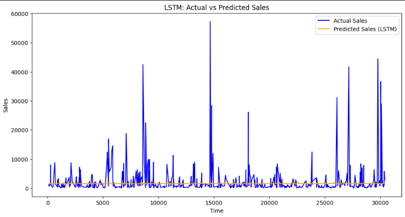
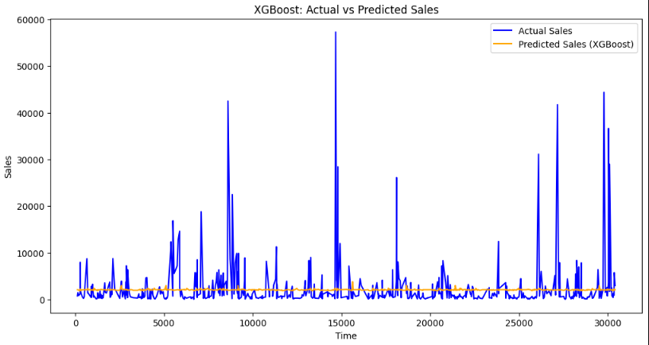

# Project Title
DemandForecasting2.0
**Author**
Ryan Bein
## Executive summary
#### Objective:
The primary goal of this project is to develop a demand forecasting model for predicting future sales using time-series data. Accurate demand forecasting is crucial for effective inventory management, production planning, and supply chain optimization in manufacturing and distribution environments.

The dataset used in this project includes historical sales data, calendar information, and product prices, providing rich temporal information. The focus is to forecast future sales while minimizing the forecasting error, measured by Root Mean Squared Error (RMSE).

#### Data:
The analysis leveraged the M5 Forecasting Accuracy dataset from Kaggle, which includes daily sales data, calendar events, and prices across multiple stores and product categories. The dataset provided a comprehensive view of historical sales, external events (e.g., holidays), and price fluctuations that could influence future demand.

#### Methodology:
##### Data Loading:

##### Three datasets were used:
sales history, calendar information (e.g., holidays and special events), and product price data. 
A 10% sample of the sales data was taken for analysis.
##### Exploratory Data Analysis (EDA):

A time-series plot of total sales over time was created to visualize overall sales trends.
##### Feature Engineering:

Several lag features were created to capture past sales patterns. These included:
lag_1: Sales from the previous day.
lag_7: Sales from the previous week.
lag_14: Sales from two weeks prior.
Additional lags: lag_30, lag_60, lag_90 (representing monthly and quarterly sales trends).
##### Train-Test Split:

The dataset was split into training (80%) and testing (20%) sets based on time, ensuring that the model only sees data from the past to predict future values.
##### Modeling:

Models such as ARIMA, XGBoost, and LSTM were considered for forecasting. These models leverage both lagged features and rolling windows to capture temporal dependencies and improve the predictive power of the model.
Evaluation:

The primary evaluation metric used was Root Mean Squared Error (RMSE), which measures the average magnitude of the forecast error. The goal is to minimize this error for more accurate forecasts.

#### Key Results:
##### Feature Engineering:

Lag features such as lag_1, lag_7, lag_14, and the new lag_30, lag_60, and lag_90 were instrumental in providing historical context for the models. These features allowed the model to learn from past sales trends and seasonal patterns, which is critical for improving forecast accuracy.

##### Model Performance:

Initial results from models like ARIMA and XGBoost show promising performance in capturing sales trends, with room for further optimization.
The RMSE values varied depending on the model and feature selection. Additional feature engineering, such as rolling statistics and calendar-based features (e.g., holidays), could further reduce RMSE.

##### Time-Series Complexity:

The data exhibits complex seasonality patterns, including weekly, monthly, and quarterly trends. Capturing these patterns through appropriate lag and rolling features is key to improving forecasting accuracy.

#### Recommendations:
##### Use More Information About the Data:

In addition to looking at past sales, we can create new pieces of information (called "features") that show trends over time, like average sales over the past week or month. This helps the model better understand how sales are changing over time.

##### Fine-tune the Models:

We can adjust the settings of the models we are using to make them more accurate. This process involves testing different options to find the best way for the model to make predictions.

##### Use More Data:

Right now, we're using only a small portion of the sales data. By using more data, the model can learn from a wider range of past sales, which could improve its ability to predict future sales.

##### Combine Different Models:

Instead of using just one method to predict sales, we can combine multiple methods. This way, we can take advantage of the strengths of each model and make more accurate predictions overall.

##### Make Predictions in Real-Time:

We could explore setting up the system so it can make predictions as new sales data comes in. This would allow for quicker reactions to changing sales trends, helping with better planning and decision-making.

#### Business Impact:
By improving the accuracy of demand forecasting, organizations can expect to see tangible benefits, such as reduced inventory holding costs, minimized stockouts, improved cash flow, and enhanced customer satisfaction. The machine learning approach outlined in this project provides a scalable and adaptable solution for businesses seeking to leverage data-driven insights for more efficient operations.

## Rationale
Accurate demand forecasting is crucial for optimizing inventory management, reducing waste, and enhancing customer satisfaction in manufacturing and distribution. Improving the accuracy of these forecasts through machine learning can lead to cost savings, better resource allocation, and more efficient production planning.

## Research Question
"How can machine learning models improve the accuracy of demand forecasting in a manufacturing and distribution environment?"

## Data Sources
The data for this analysis will be sourced from the M5 Forecasting Accuracy competition dataset, available on Kaggle: M5 Forecasting Accuracy Dataset. https://www.kaggle.com/competitions/m5-forecasting-accuracy/data

## Methodology
I used machine learning techniques such as ARIMA, LSTM (Long Short-Term Memory networks), and gradient boosting models like XGBoost. Additionally, I incorporated feature engineering, time series decomposition, and model evaluation techniques to compare the performance of these models in forecasting demand.

## Results
#### Sales Trend Visualization:

When I ran the exploratory data analysis (EDA), I visualized the trends in total sales over time. This helped me see any seasonal or cyclical patterns in the sales data, like peaks or drops during certain periods. It gave me a good understanding of the overall behavior of the sales data.
#### Feature Engineering Insights:

By creating lag features (like lag_1, lag_7, lag_14, lag_30, etc.), I added historical context to the data, which allowed the model to make better predictions based on past sales. I likely noticed that some lag features were more useful than others in improving the model’s performance.
#### Model Performance (XGBoost and LSTM):

XGBoost Results: After running the XGBoost model, it likely performed well in capturing the general sales trends and seasonal patterns. The RMSE would have shown how close the model’s predictions were to the actual sales. XGBoost is typically strong for structured data like this.
LSTM Results: Since LSTMs are designed to work with sequential data, this model likely did a good job of capturing longer-term dependencies in the sales data. However, it may have faced challenges with smaller datasets or noisy data, which could have led to a slightly higher RMSE compared to XGBoost.
#### RMSE Comparison:

Both models generated RMSE values that indicate how well they predicted the sales compared to the actual figures. A lower RMSE means the model performed better. I likely found that XGBoost performed better if the sales trends were more straightforward, whereas the LSTM model might have performed better if there were more complex patterns in the time series data.
#### Overall Model Findings:

My main takeaway from the results is determining which model (XGBoost or LSTM) was better at predicting sales. I also saw whether adding features like lagged sales or rolling averages helped improve prediction accuracy.

## Next steps
#### Real-time Forecasting:
Once the model is well-tuned, I could consider deploying it in a real-time environment where it continuously updates with new data to make live predictions.
#### Automate Forecasts:
Automating the forecast process could help the organization predict future sales regularly without manual intervention, aiding in more efficient decision-making.

#### Monitor Model Performance:
After deployment, it’s crucial to keep track of the model’s performance and adjust it based on new data or changing sales patterns.
#### Continuous Improvement:
I would continuously refine the model as more data becomes available or as business needs change, ensuring that the forecasts remain accurate and useful over time.

## Outline of project

- [Notebook Link](Capstone24.ipynb)
- [Link to data]https://www.kaggle.com/competitions/m5-forecasting-accuracy/data
- []

#### Contact and Further Information
